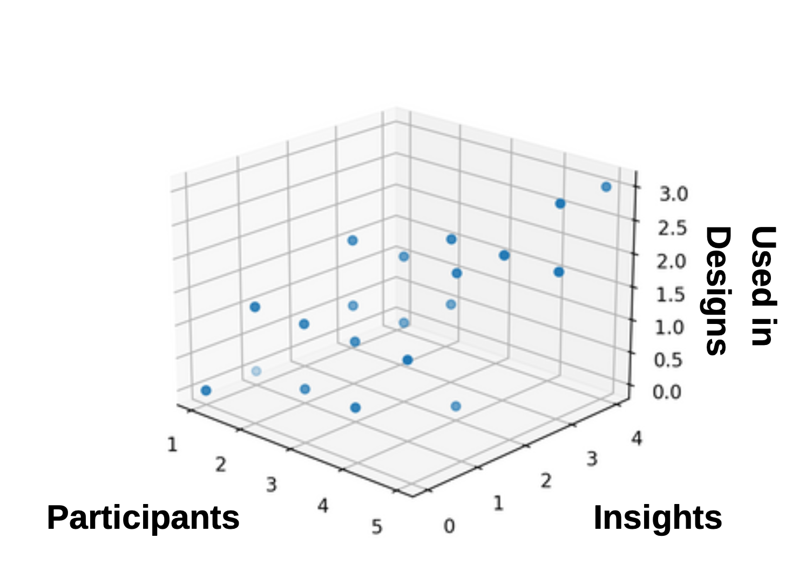
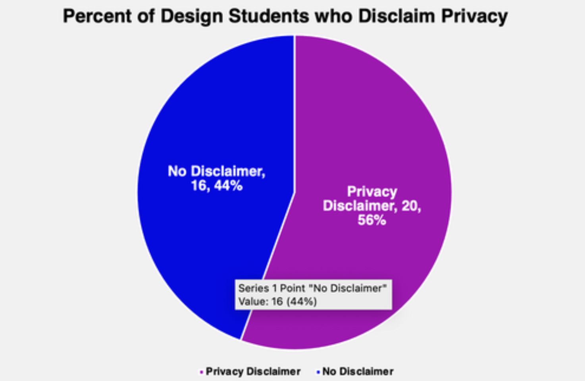

# CE395-QualDataEthic
Quick scatterplot analysis of primary data. Research of qualitative data usage within design majors to determine ethical considerations.
Questions:

1. How many participants did you examine? 
2. How many insights were pulled? 
3. How many of those insights guided your design?

